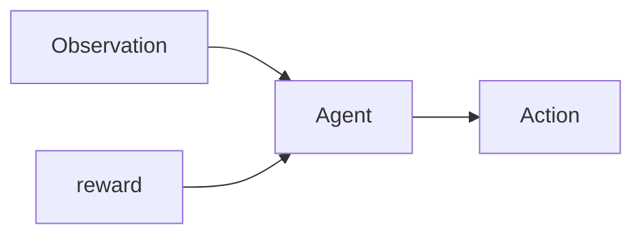
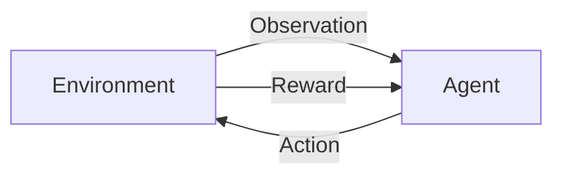
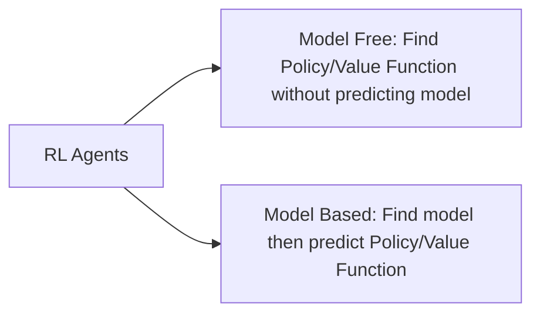
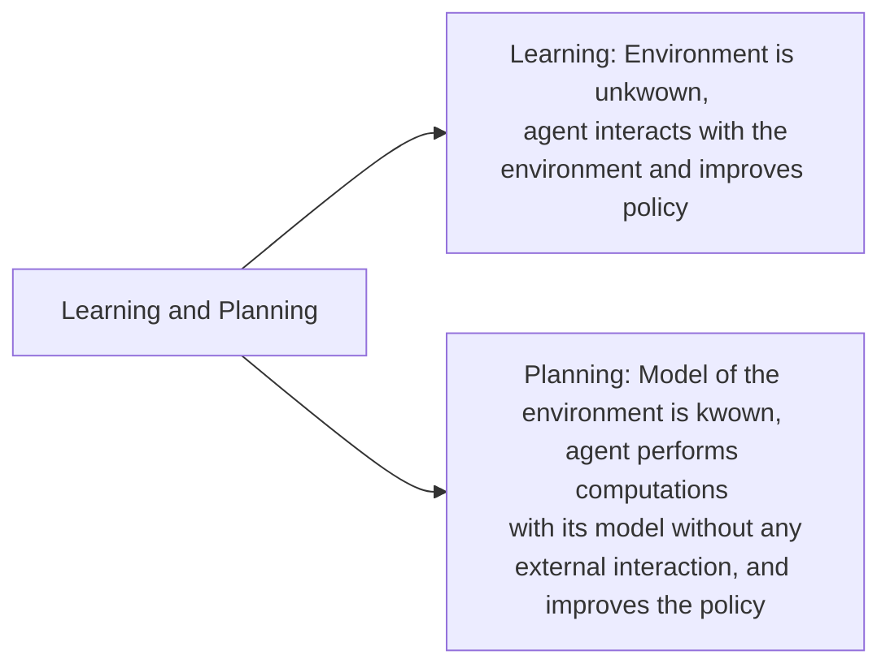

# **Reinforcement Learning**

### **Contents**
1. [Introduction to Reinforcement Learning](#introduction-to-reinforcement-learning)
2. [The Reinforcement Learning Problem](#the-reinforcement-learning-problem)
2. [The RL Agent](#the-rl-agent)
2. [Problems within Reinforcement Learning](#problems-within-reinforcement-learning)
2. [Markov Decision Process ](#markov-decision-process)
2. [Monte-Carlo Reinforcement Learning](#monte-carlo-reinforcement-learning)
2. [Temporal Difference Learning](#temporal-difference-learning)
4. [Function Approximation](#function-approximation)
5. [Policy Gradient](#policy-gradient)


<br>
<br>

---
### **Introduction to Reinforcement Learning**
### Machine Learning consists of:
1. Supervised Learning 
2. Unsupervised Learning 
3. Reinforcement Learning

### Difference from other machine learning algorithms:  
1. There is no 'supervisor', only a reward signal
2. The feedback is delayed, not instantaneous
3. Time matters (sequential, non iid (independent and identically distributed) data)
4.  Actions affect subsequent data


### Misc
1. Takes 2-3 days to train a policy

<br>

---

### **The Reinforcement Learning Problem:**
### Reward R<sub>t</sub>
1.  scalar feedback signal inducating how well the agent is doing
> **Def<sup>n</sup>** Reward Hypothesis: All goals can be described by the maximisation of expected cumulative reward

<br>

### Goal
1. Select actions to maximise total future reward
2. It may be better to sacrifice immediate reward to gain more long term reward.

<br>

### Agent and Environment

Our job is to figure out what algorithm sits inside *Agent*



At each time step *t*
- The Agent: Executes action A<sub>t</sub>, Receives observation O<sub>t</sub> , Receives scalar reward R<sub>t</sub>
- The Environment: Receives action A<sub>t</sub>, emits observation O<sub>t</sub> , emits scalar reward R<sub>t</sub>

<br>

### History
Sequence od observations, actions, rewards

$H_{t}=A_{1},O_{1},R_{1}\ldots A_{t}, O_{t},R_{t}$

Based on the history:
1. Agent selects actions
2. Environment selects observation

<br>

### State
1. information used to determine what happens next
2. $S_{t} = f(H_{t})$

<br>

### Environment state $S_{t}^{e}$
1. Environments private representation 
2. What state is the environment in?
3. this data is used by the environment to pick the next observation/state
4. Not always visible to the agent, agent only gets state and reward

<br>

### Agent State $S_{t}^{a}$
1. Numbers that represent the agents state
2. This data is used to pick the next action by the reinforcement learning algorithm
3. Can be a function of history: $S_{t}^{a} = f(H_{t})$

<br>

### Information/Markov State
1. Contains all important information from the history

> **Def<sup>n</sup>** A state is *Markov* iff 
> $$P\left[ S_{t+1}| S_{t}\right] =P\left[ S_{t+1}| S_{1},\ldots S_{t}\right]$$

2. The future is independent of the past given the present: 
$H_{1:t}\rightarrow S_{t}\rightarrow H_{t+1:\infty}$

 3. The environment state $S_{t}^{e}$ is Markov as it takes decision based on current state 

 4. The history $H_{t}$ is also a Markov state, although a bad/useless one

<br>

 ### Fully Observable Environment
 1. 
 >**Def<sup>n</sup>** Full ovbservability: agent ditectly observes environment state:
> $$O_{t} = S_{t}^{a} = S_{t}^{e}$$

2. Agent state = environment state = information state
3. This is kwown as **Markov Decision Process**
  
<br>

### Partial Observability
1. Agent *indirectly* observes environment 
2. Agent state $\neq$ environment
3. **Partially observable Markov decision process(MDP)**
4. Agent must construct its own state representation $S_{t}^{a}$
5. Naive approach: $S_{t}^{a}= H_{t}$
6. **Beliefs** of environment state:  $S_{t}^{a}= (P[S_{t}^{e} = s^{1}], \ldots, P[S_{t}^{e} = s^{n}])$
7. Recurrent nueral network: $S_{t}^{a} = \sigma(S_{t}^{a} W_{s} + O_{t}W_{0})$

<br>

---
### **The RL Agent**

### Policy: agents behaviour function
#### **Value Function:** how good each state and/or action
#### **Model:** agents representation of the environment

### Policy
*agents behaviour function*
1. map from state to action
2. Deterministic Policy: $a = \pi(s)$
2. Stochastic Policy: $\pi(a|s) = P[A = a| S = s]$

### Value Function:
how good each state and/or action
1. Prediction of future reward
2. Used to evaluate *goodness* of states
3. $V_{\pi }\left( s\right) =E_{\pi }[ R_{t}+\gamma R_{t+1}+\gamma ^{2}R_{t+2}+\ldots | S_{t}= s]$

### Model:
agents representation of the environment
1. Predicts what the environment will do next
2. **Transition**: $\mathcal{P}$ predicts the next state 
3. **Rewards:** $\mathcal{R}$ predicts the next (immediate) reward
 $$\mathcal{P} = \mathbb{P}[S' = s' | S=s, A=a]$$
 $$\mathcal{R} = \mathbb{E}[R| S=s, A=a]$$

 ### Categorizing RL agents
 ```mermaid
graph LR
A[RL Agents] -->B[Value Based: No Policy/Implicit Policy, Value Function]
A --> C[Policy Based: Policy, has no Value Function]
A --> D[Actor Critic: has Policy as well as Value Function]

```

<br>

---
### **Problems within Reinforcement Learning**
1. 


2. Exploration and exploitation: Finding balance between exploration and exploitation.

<br>
<br>
<br>

---
### **Markov Decision Process**
1. MDPs formally describe an environment
3. Environment is *fully observable*
3. Current state completely characterises the process
4. Almost all RL problems can be formalised with MDPs, e.g. optimal control, partially observable problems can be converted to into MDPs, Bandits are MDPs with one state

<br>

### Markov Property
*"The future is independent of the past given the present"*
> **Def<sup>n</sup>** A state is *Markov* iff 
> $$P\left[ S_{t+1}| S_{t}\right] =P\left[ S_{t+1}| S_{1},\ldots S_{t}\right]$$

<br>

### State Transition Matrix
State Transition Probability:
$$\mathcal{P}_{ss'} = \mathbb{P}[S' = s' | S=s]$$
State Transition Matrix $\mathcal
{P}$ defines transition probabilities from all states s to all successor states s', 
$$ \mathcal{P}=from(columns), to (rows) \begin{bmatrix}
\mathcal{P}_{11} & \ldots  & \mathcal{P}_{1n} \\\vdots && \vdots\\
\mathcal{P}_{n1}, & \ldots  & \mathcal{P}_{nn}
\end{bmatrix}$$
Each row sums to 1

<br>

### Markov Process
A Markov process is a memoryless random process, i.e. a sequence of random states $S_{1}, S_{2}, S_{3}..$ with the Markov Property.
> **Def<sup>n</sup>** *Markov Process* (or *Markov Chain*) is a tuple $\langle \mathcal{S}, \mathcal{P}\rangle$
> - $\mathcal{S}$ is a finite set of states
> - $\mathcal{P}$ is a state transition probability matrix, 
> $$\mathcal{P}_{ss'} = \mathbb{P}[S' = s' | S=s]$$

<br>

### Markov Reward Proccess
> **Def<sup>n</sup>** *Markov Reward Process* is a tuple $\langle \mathcal{S}, \mathcal{P}, \mathcal{R}, \gamma \rangle$
> - $\mathcal{S}$ is a finite set of states
> - $\mathcal{P}$ is a state transition probability matrix, 
> $$\mathcal{P}_{ss'} = \mathbb{P}[S' = s' | S=s]$$
> - $\mathcal{R}$ is a reward function, 
> $$ \mathcal{R}_{s} = \mathbb{E}[R_{t+1}|S_{t}= s]$$
> - $\gamma$ is a discount function, $\gamma \in [0, 1]$

<br>

### Return

> **Def<sup>n</sup>** Return $G_{t}$ is the total reward from time-step t 
> $$G_{t}=R_{t+1}+\gamma R_{t+2}\ldots =\sum ^{\infty }_{k=0}\gamma ^{k}R_{t+k+1}$$
- The value of receiving reward R after k+1 time steps is $\gamma^{k}R$

<br>

### Why discount?
- Uncertainty: We do not have a perfect model, we dont want to trust the future too much.
- Mathematically convenient 
- Avoids infinite returns
- Uncertainty about the future may not be fully represented 
- If the reward is finantial, immdiate rewards may earn more interest than delayed rewards
- Animal/human behaviour shows preference for immediate reward

<br>

### Value Function
- The value function v(s) gives the long-term values of state s
> **Def<sup>n</sup>**  The *value function v(s)* of an MRP is the expected return starting from state s
> $$v(s) = \mathbb{E}[G_{t}|S_{t} = s]$$
 - How to calculate? Take multiple samples from the Markov process, find discount reward for each sample(episode) anad then take average.

<br>

### Bellman Equantion
The value function can be decomposed into summation of immediate reward($R_{t+1}$) and value of succesor state $\gamma$ $v(S_{t+1})$
$$ \begin{align*} v(s) &= \mathbb{E}[G_{t}| S_{t} = s]\\ &=\mathbb{E}[R_{t+1}+\gamma R_{t+2}\ + \gamma^{2} R_{t+3} + \ldots | S_{t} = s]\\&= \mathbb{E}[R_{t+1}+\gamma R_{t+2}\ + \gamma^{2} R_{t+3} + \ldots | S_{t} = s]\\ & = \mathbb{E}[R_{t+1}+\gamma(R_{t+2}\ + \gamma R_{t+3} + \ldots )| S_{t} = s]\\ &= \mathbb{E}[R_{t+1}+\gamma G_{t+1}| S_{t} = s] \end{align*}$$

In Matrix Form,
$$ \begin{bmatrix}\ v(1)\\\vdots\\v(n)\end{bmatrix} = \begin{bmatrix} \mathcal{R}_{1}\\ \vdots \\ \mathcal{R}_{n} \end{bmatrix}+\gamma\begin{bmatrix}
\mathcal{P}_{11} & \ldots  & \mathcal{P}_{1n} \\\vdots && \vdots\\
\mathcal{P}_{n1}, & \ldots  & \mathcal{P}_{nn}
\end{bmatrix} \begin{bmatrix} v(1) \\ \vdots \\ v(n)\end{bmatrix}$$
which is, 
$$v = \mathcal{R} + \gamma \mathcal{P}v$$


<br>

### Solving Bellman equation
$$\begin{align*}v &=  \mathcal{R} + \gamma \mathcal{P}v\\ v(1 - \gamma \mathcal{P}) &=  \mathcal{R} \\ v &=(1 - \gamma \mathcal{P})^{-1}\mathcal{R}  \end{align*} $$
- Direct solutoin only possible for small MRP
- Many iterative methods are available for large MRPs e.g. Dynamic programming, Monte-Carlo evalulation, Temporal Difference learning

<br>

### Markov Decison Process
- A Markov Decision process is a Markov reward process with decisions. It is an *environment* in which all states are Markov
> **Def<sup>n</sup>** *Markov Decision Process* is a tuple $\langle \mathcal{S}, \mathcal{A}, \mathcal{P}, \mathcal{R}, \gamma \rangle$
>- $\mathcal{S}$ is a finite set of states
>- $\mathcal{A}$ is a finite set of actions
>- $\mathcal{P}_{ss'}^{a} = \mathbb{P}[S_{t+1} = s' | S_{t}=s, A_{t}=a]$
>- $\mathcal{R}$ is a reward function $ \mathcal{R}_{s}^{a} = \mathbb{E}[R_{t+1}|S_{t}= s, A_{t} = a]$
>- $\gamma$ is a discount factor $\gamma \in [0, 1]$

<br>

### Policy 
> **Def<sup>n</sup>** *Policy* $\pi$ is a distribution over all actions given states, 
> $$\pi(a|s) = \mathbb{P}[A_{t} = a|S_t = s]$$
- A policy fully defines the behaviour of an agent
- Given an MDP $\mathcal{M} = \langle \mathcal{S}, \mathcal{A}, \mathcal{P}, \mathcal{R}, \gamma \rangle $ and a policy $\pi$ 
- The state sequence $S_1, S_2. S_3...$ is a Markov reward process $\langle \mathcal{S}, \mathcal{P}^\pi  \rangle$
- The state and reward process $S_1, R_2, S_2...$ is a Markov reward process $\langle \mathcal{S}, \mathcal{P}^\pi, \mathcal{R}^\pi, \gamma \rangle$
- where 
$$\mathcal{P}_{s, s'}^\pi = \sum_{a \in \mathcal{A}} \pi(a|s)\mathcal{P}_{s, s'}^{a}$$
$$\mathcal{R}_{s, s'}^\pi = \sum_{a \in \mathcal{A}} \pi (a|s) \mathcal{R}_{s}^a$$

<br>

### Value Function
How good a state is
> **Def<sup>n</sup>** The *state-value function* $v_{\pi}(s)$ of an MDP process is the expected return starting from state s, and then following policy $\pi$
> $$v_{\pi}(s) = \mathbb{E}_{\pi}[G_t|S_t = s]$$

<br>

### Action value Function
How good an action is
> **Def<sup>n</sup>** The *action-value* function 
> $$q_{\pi}(s, a) = \mathbb{E}_{\pi}[G_t|S_t=s, A_t = a]$$

<br>

### Bellman equation 
$$v_{\pi}(s)= \mathbb{E}[R_{t+1}+\gamma G_{t+1}| S_{t} = s]$$
$$q_{\pi}(s, a) = \mathbb{E}_{\pi}[R_{t+1}+\gamma q_{\pi}(S_{t+1}, A_{t+1})|S_t =s, A_t = a]$$

value function finds expectation over all possible actions, action value finds expectation given an action, in a state.

<br>

### Bellman expectation for equation for $Q^{\pi}$
$$q_{\pi}(s, a) = \mathcal{R}_{s}^{a}+\gamma \sum_{s' \in \mathcal{S}} \mathcal{P}_{ss'}^{a} v_{\pi}(s') $$
weighted sum over all possible states after performing action s
### Bellman equation for $v_{\pi}$

$$v_{\pi}(s) = \sum_{a \in \mathbb{A}} \pi(a|s) q_{\pi}(s, a)$$
Weighted sum over all actions

both together gives, 

$$v_{\pi}(s) = \sum_{a' \in \mathcal{A}}\pi(a|s)(\mathcal{R}_s^{a}+ \gamma \sum_{s' \in \mathcal{S}}\mathcal{P}_{ss'}^{a}\sum_{a' \in \mathcal{A}}\pi(a|s)q_{\pi}(s', a')$$

<br>

### Optimal Value Function

> **Def<sup>n</sup>** The *optimal state-value* function $v_{*}(s)$ is the maximum value function over all policies
> $$v_{*}(s) = \underset{\pi}{max} v_{\pi}(s)$$
> **Def<sup>n</sup>** The *optimal action-value* function $q_{*}(s, a)$ is the maximum action-value function over all policies
> $$q_{*}(s, a) = \underset{\pi}{max} q_{\pi}(s, a)$$

*An MDP is said to be solved when we know the optimal functions and the corresponding policy*

<br>

### Optimal Policy
> **Theorum** For any MDP
> - There exists an optimal policy $\pi_{*}$ that is better than or equal to all other policies, $\pi_{*} \geq \pi, \forall \pi$
> - All optimal policies achieve the optimal value function, $v_{\pi_{*}}(s) = v_{*}(s)$
> - All optimal policies achieve the optimal action-value function, $q_{\pi_{*}}(s, a) = q_{*}(s, a)$

A policy $\pi$ is better than or equal to a policy $\pi'$ if its expected return is greater than or equal to that of $\pi'$ for all states. $\pi \geq \pi'$ if $v_{\pi}(s) \geq v_{\pi'}(s), \forall s \in \mathcal{S}$

<br>

### Optimal Policy if $q_{*}$ is known

$$\pi_{*} (a|s)= \begin{cases}
1 & \text{ if a = $\underset{a \in \mathcal{A}}{\operatorname{argmax}}$ $q_{*}$ (s, a)}\\
0 & \text{otherwise} \\
\end{cases}$$
- There is always a deterministic optimal policy for any MDP (??)

<br>

### Bellman optimality equation for $v_{*}$
$$v_{*}(s) = \underset{a \in \mathcal{A}}{max} q_{*}(s, a)$$

<br>

### Bellman optimality equation for $q_{*}$

$$ q_{*}(s, a) = \mathcal{R}_{s}^{a} + \gamma \sum_{s' \in \mathcal{S}}\mathcal{P}_{ss'}^{a}v_{*}(s')$$

<br>

### Bellman Optimality equation for $v_{*} (2)$

$$v_{*}(s) = \underset{a}{max} \mathcal{R}_{s}^{a} + \gamma \sum_{s' \in S} \mathcal{P}_{ss'}^{a} v{*}(s') $$

<br>

### Bellman Optimality equation for $q_{*} (2)$

$$q_{*}(s, a) = \mathcal{R}_{s}^{a} + \gamma \sum_{s' \in S} \mathcal{P}_{ss'}^{a} \underset{a'}{max} q_{*}(s', a') $$

<br>

### Solving Bellman Optimality equation
Bellman Optimality Equation is non-linear, no closed form solution in general. Many iterative solution methods, like value iterationm policy iteration, Q-learning, Sarsa etc. exist.

<br>

### Partially Observable MDPs (POMDPs)

> **Def<sup>n</sup>** *Partially Observable MDPs* (POMDPs) is a tuple $\langle \mathcal{S}, \mathcal{A}, \mathcal{P}, \mathcal{R}, \mathcal{O}, \mathcal{Z}, \gamma \rangle$
> - $\mathcal{S}$ is a finite set of states
> - $\mathcal{A}$ is a finite set of actions
> - $\mathcal{P}_{ss'}^{a} = \mathbb{P}[S_{t+1} = s' | S_{t}=s, A_{t}=a]$
> - $\mathcal{R}$ is a reward function $ \mathcal{R}_{s}^{a} = \mathbb{E}[R_{t+1}|S_{t}= s, A_{t} = a]$
> - $\mathcal{O}$ is a finite set of observations
> - $\mathcal{Z}_{s}^{a} = \mathbb{P}[O_{t} = o| S_{t} = s, A_{t} = a]$
> - $\gamma$ is a discount factor $\gamma \in [0, 1]$


<br>

### Belief State

> **Def<sup>n</sup>** *history* $H_{t}$ is the sequence of actions, observations, rewards till time t
> $$H_{t} = A_{1}, O_{1}, R_{1}, \ldots, A_{t}, O_{t}, R_{t}$$

> **Def<sup>n</sup>** *Belief State* $b$ is a probability distribution over states,
> $$b(s) = \mathbb{P}[S_{t} = s| H_{t}]$$

history and belief state are Markov, i.e. $H_{t} \rightarrow S_{t} \rightarrow H_{t+1}$ and $b_{t} \rightarrow S_{t} \rightarrow b_{t+1}$
<br> A POMDP can be reduced to an (infinite) history or belief state tree. (??)

<br>

### Ergodic Markov Process:
An ergodic Markov process is:
- Recurrent: each state is visited an infinite number of times
- Aperiodic: each state is visited without any systematic period

> **Theorum** An ergodic Markov process has limting stationary distribution $d_{\pi}(s)$ with the property 
> $$d_{\pi}(s) = \sum_{s' \in \mathcal{S}} d_{\pi}(s') \mathcal{P}_{s's}^{a}$$

limiting means after almost infinite steps

<br>

### Ergodic MDPs:

> **Theorum** An MDP is if the Markov chain induced by any policy is ergodic.

For any policy $\pi$, an ergodic MDP has an average reward per time-step $ \rho^{\pi} = \underset{T \rarr \infin}{lim} \frac{1}{T} \mathbb{E}  [ \sum_{t=1}^{T} R_{t} ]$

Average Reward Value Function <br> $v_{\pi}(s) = \mathbb{E} \Big[ \sum_{k=1}^{\infin} (R_{t+k} - \rho^{\pi})|S_{1} = s \Big]$

<br>

---

### **Monte-Carlo Reinforcement Learning**

*Goal:  To learn $v_{\pi}$ online from experience under policy $\pi$*

### First visit Monte-Carlo Policy Evaluation
> To evaluate state s, <br>
>In each episode<br>
>For the *first* time-step that state s is visited,  
>$$\begin{align*} &N(s) \larr N(s) + 1\\ &S(s)\larr S(s) + G_t\end{align*}$$
> <br>
> After all episodes,
>
> $$V(s) = S(s)/N(s)$$
- $V(s) \rarr V_{\pi}(s) \space as \space N(s) \rarr \infin$

<br>

### Every visit Monte-Carlo Policy Evaluation
> To evaluate state s, <br>
>In each episode<br>
>For *every* time-step that state s is visited,  
>$$\begin{align*} &N(s) \larr N(s) + 1\\ &S(s)\larr S(s) + G_t\end{align*}$$
> <br>
> After all episodes,
>
> $$V(s) = S(s)/N(s)$$
- $V(s) \rarr V_{\pi}(s) \space as \space N(s) \rarr \infin$

<br>

### Incremental Monte Carlo Updates

Every visit Monte Carlo update can be expressed as:
> In each episode <br>
> For each state $s_t$ with return $G_t$
>$$\begin{align*} &N(S_t) \larr N(S_t) + 1\\ &V(S_t) \larr 
V(S_t) + \frac{1}{N(S_t)}(G_t - V(S_t)) \end{align*}$$

<br>

### Tracking a running mean

> In each episode <br>
> For each state $s_t$ with return $G_t$
>$$\begin{align*} &N(S_t) \larr N(S_t) + 1\\ &V(S_t) \larr 
V(S_t) + \alpha(G_t - V(S_t)) \end{align*}$$

$N(S_t)$ increases over time making the effect of error lesser and lesser, alpha puts a limit to it, making $V(S_t)$ more susceptable to $G_t$ the latest calculated reward, thus decreasing the effects of old episodes.

<br>

### Imp Points
1. Model free <br> 
2. Learns from complete episodes, no bootstrapping <br>
3. Can only apply to episodic MDPs; all episodes must terminate 
4. Value = mean return
4. MC has high variance, zero bias
    -  Return $G_t = R_{t+1} + \gamma R_{t+2} + \gamma^{2} R_{t+3} ...$ is *unbiased* estimate of $v_{\pi}(S_t)$
    - Return depends on *many* random actions, transitions and rewards 
    
    <br>
5. Good convergence properties 
6. Not sensitive to initial value
7. Converges to solution with mean-squared error 
$$\sum_{k=1}^{k} \sum_{t=1}^{T_k}(g_t^{k}-V(s_{t}^{{}}))^{2}$$
8. Does not exploit Markov Property, usually effective in non- Markov environments

<br>

---

### **Temporal Difference Learning**
doubt: how do we know V(s'), s>s' if we havent explored s' before?
### TD(0)
We update value fuction with estimated reward $R_t + \gamma V(S_{t+1})$ instead of sampled return $G_t$ as in the case of Monte Carlo.

> In each episode, <br>
> For each state $s_t$ with return $G_t$
>$$\begin{align*} &N(S_t) \larr N(S_t) + 1\\ &V(S_t) \larr 
V(S_t) + \alpha(\overbrace{\underbrace{R_t+ \gamma V(S_{t+1})}_{TD \space target} - V(S_t))}^{TD \space error} \end{align*}$$

<br>


### Imp Points
1. Model- free
2. Learns from incomplete episodes, by bootstrapping
3. Updates a guess towards a guess(prbable MDP)
2. TD has low variance, some bias
    1. True TD target $R_{t+1}+ \gamma v_{\pi}(S_{t+1})$ is an unbiased estimate of $v_{\pi}(S_{t+1})$
    2. TD target depends on one ransom action, transision, reward

    <br>

5. TD converges to solution of max likelihood Markov model.
$\space \space \space \space \space \space \space \space \space$ Solution to the MDP $ \langle \mathcal{S}, \mathcal{A}, \hat{\mathcal{P}}, \hat{\mathcal{R}}, \gamma \rangle $ that best fits the data,
$$\hat{\mathcal{P}}_{s,s'}^{a} = \frac{1}{N(s, a)}\sum_{k = 1}^{K} \sum_{t = 1}^{T_K}1 \space (s_t^k, a_t^k, s_{t+1}^k = s, a, s')$$
$$\hat{\mathcal{R}}_{s, s'}^{a} = \frac{1}{N(s, a)} \sum_{k = 1}^{K} \sum_{t = 1}^{T_k} 1 (s_t^k, a_t^k =s, a)r_t^k $$
6. Exploits Markov Property, more effective in Markov environments

<br>

### n step TD


> In each episode <br>
> For each state $s_t$ with return $G_t$
>$$\begin{align*} &N(S_t) \larr N(S_t) + 1\\ &V(S_{t}) \larr V(S_{t}) + \alpha (G_t^{(n)} - V(S_t)) \end{align*}$$
Take n step return,  instead of 1 step return <br> 
n = 1: $G_t^{1} = R_{t+1} + \gamma V(S_{t+1})$ (TD(0)) <br>
n = 2: $G_t^{(2)} = R_{t+1} + \gamma R_{t+2} + \gamma^{2} V(S_{t+2})$<br>
$ \vdots $ <br>
n = $\infin $ : $G_{t}^{\infin} = R_{t+1} + \gamma R_{t+2}+ \ldots +\gamma^{n} R_{n}$ (Monte Carlo)

 
<br>

### forward view TD($ \lambda $)
> In each episode <br>
> For each state $s_t$ with return $G_t$
>$$\begin{align*} &N(S_t) \larr N(S_t) + 1\\ &V(S_{t}) \larr V(S_{t}) + \alpha (G_t^{\lambda} - V(S_t)) \end{align*}$$
$G_t^{\lambda}$ combines all n step returns $G_{t}^{(n)}$ till n = $\infin$ as:
$$G_T^{\lambda} = (1 - \lambda)\sum_{n=1} \lambda^{n-1} G_{t}^{(n)} $$ 
Can only be computed from complete episodes, like Monte Carlo

<br>

### Eligibility Trace
hueristic that combinely tells us of how frequently a state was visited and how recently.
$$E_{0}(s) = 0$$
$$E_{t}(s) = \gamma \lambda E_{t-1}(s) + 1 (S_t = s)$$

<br>

### Backward view TD( $\lambda$ )
 >In each episode, <br>
 > For each state s, <br> 
 > $V(s) \larr V(s) + \alpha \delta_{t} E_{t}(s)$
 $$\delta_{t} = R_{t+1} + \gamma V(S_{t+1}) - V(S_t)$$

<br>

> **Theorum** The sum of offline updates is identical for forward-view and backward-view TD($\lambda $ ) 
> $$ \sum_{t=1}^{T} \alpha \delta_{t} E_{T}(S) = \sum_{t=1}^{T} \alpha (G_{t}^{\alpha} - V(S_{t}))$$

### Forward and backward view of TD($ \lambda $)
<br>

 **to do**  

<br>


---
### **MC vs TD**

| Monte Carlo   | Temporal Difference |
| ----------- | ----------- |
| Must wait till end of episode      | Can learn after every step       |
| Can only learn from complete sequences   | Can learn from incomplete sequences too       |
|Only works for episodic(terminating) environments| Works in continuing(non- terminating) environments too|
|high variance, zero bias: <br> - good convergence properties even with function approximation <br> - Not very sensitive to inital value|Low variance, some bias:<br>- TD(0) converges to $v_{\pi}$, but not always with function approximation<br>- more sensitive to initial value<br> - Usually more efficient than MC|
|Does not exploit Markov Property; more efficient in non- Markov environments| Exploits Markov property, more effective in Markov environments|


<br>

---
###  **On Policy vs Off Policy**

#### On policy:
 
 - Learn on the job 
 - Learn about policy $ \pi $ from experience sampled from $ \pi $

#### Off policy :
- Look over someone's shoulder
- Learn about policy $ \pi $ from experience sampled from $ \mu $

<br>

---

###  **Monte Carlo Policy Iteration**
 *doubt: a deterministic greedy policy update limits exploration, why is this not a problem for dynamic programming*

 We do Policy iteration using 
 
 1. **Policy Evaluation** Monte Carlo policy evaluation, Q = $q_{\pi }$
 2. **Policy Improvement** $\epsilon $-greedy policy improvement

<br>

 ### $\epsilon $ greedy policy

 $$\pi (a|s)= \begin{cases}
\epsilon /m +1 - \epsilon, & \text{ if  $a^{*}$ = $\underset{a \in \mathcal{A}}{\operatorname{argmax}}$ Q(s, a)}\\
\epsilon /m & \text{otherwise} \\
\end{cases}$$

<br>

> **Theorum** For any $\epsilon $-greedy policy $\pi $, the $\epsilon$-greedy policy $\pi$' with respect to $q_{\pi}$ is an improvement, $v_{\pi'} \ge v_{pi}(s)$

<br>

### Imp Points:
1. Unlike policy iteration in case of dynamic programming, we can not use state value funciton( $V_{\pi} $) becuase that requires knowing the model:$$ \pi'(s) = \underset{a \in \mathcal{A}}{\operatorname{argmax}} \space \mathcal{R}_{s}^{a}+ \underline{\mathcal{P}_{ss'}^{a}}V(s')$$ so we use action-value instead:$$\pi'(s) = \underset{a \in \mathcal{A}}{argmax} \space Q(s, a)$$
2. We cannot use a greedy determinsitic policy update because that restricts exploration. 
3. We dont gave to take Monte Carlo to infinity and find the actual value function, we may do policy evaluation every episode (Q $\approx q_{\pi}$), and then immediately improve, . This still converges to the optimal policy.

<br>

### GLIE Monte Carlo Control
doubt: whats k?

*Greedy in the Limit with Infinite Exploration:*

1. All state-action pairs are explored infinitely many times: $$\lim_{k \rarr \infin} N_{k}(s, a) = \infin$$
2. Policy converges to a greedy policy: $$ \lim_{k \rarr \infin} \pi_{k}(a|s) = 1 (a = \underset{a' \in \mathcal{A}}{argmax} Q_{k}(s, a'))$$ 


> Sample $k^{th}$ episode using 
$\pi:$ { $ S_1, A_1, R_2, ... , S_t$ } ~ $\pi $ 
> <br> For each state $S_t$ and action $A_{t}$ in the episode,
> $$\begin{align*} &N(S_t, A_t) \rarr N(S_t, A_t)+1 
> \\ &Q(S_t, A_t) \rarr Q(S_t, A_t) + \frac{1}{N(S_t, A_t)}(G_t - Q(S_t, A_t)) \end{align*}$$
> Improve policy based on new action-value function:
>$$\begin{align*} & \epsilon \larr 1/k \\ & \pi \larr \epsilon greedy(Q) \end{align*}$$
note:we are not exactly calculating a mean, the policy keeps cahnging before adding a new experience.

<br>

> **Theorum** GLIE Monte-Carlo control converges to the optimal action-value  function, $Q(s, a) \rarr q_{*}(s, a)$

<br>

---
### **SARSA**:

1. **Policy evaluation Sarsa**: Q $ \approx $ $q_{\pi}$
2. **Policy improvement**: $\epsilon$ greedy policy improvement 

<br>

### SARSA update
$$Q(s, a) \larr Q(s, a)+ \alpha(R + \gamma Q(S', A') - Q(S, A))$$
we start off with S, A get reward R, reach state S', and then we sample our policy to get action A'

> In each episode: <br>
> Choose A from S using policy derived from Q <br>
> At every time step: <br>
>Take action A, observe R, S' <br>
>    Choose A' from S' using policy derived from Q <br>
>    $Q(S, A) \larr Q(S, A) + \alpha [R + \gamma Q(S', A') -Q(S, A)]$
>    $S \larr S'; A\larr A'$

<br>

> **Theorum** Sarsa converges to the optimal action-value function, 
$Q(a, s) \rarr q_{*}(s, a)$ , under the following conditions <br>
> 1. GLIE sequence of policies $\pi_{t}(a|s)$ <br>
> 2. Robbins-Monroe sequence of step-sizes $\alpha_{t}$
> $$ \begin{align*} &\sum_{t =1}^{\infin} \alpha_{t} = \infin\\ &\sum_{t =1}^{\infin} \alpha^{2}_{t} < \infin \end{align*} $$

### n step SARSA

$$Q(A_{t}, S_{t}) \larr Q(S_{t}, A_{t})+ \alpha(q_{t}^{(n)} - Q(S, A))$$
n step Q return <br>
n = 1: $q_t^{(1)} = R_{t+1} + \gamma Q(S_{t+1})$ (Sarsa) <br>
n = 2: $q_t^{(2)} = R_{t+1} + \gamma R_{t+2} + \gamma^{2} Q(S_{t+2})$<br>
$ \vdots $ <br>
n = $\infin $ : $q_{t}^{\infin} = R_{t+1} + \gamma R_{t+2}+ \ldots +\gamma^{n} R_{n}$ (Monte Carlo)
<br>note: update would now have to at end of episode

<br>

### Forward View SARSA($\lambda$)
$$\begin{align*} &Q(A_{t}, S_{t}) \larr Q(S_{t}, A_{t})+ \alpha(q_{t}^{\lambda} - Q(S, A)) \\ &q_{t}^{\lambda} = (1-\lambda)\sum_{n =1}^{\infin}\lambda^{n-1}q_{t}^{(n)} \end{align*}$$
note: update would now have to at end of episode

<br>

### Backward View SARSA($\lambda$)

<br>

---
### **Function Approximation**

Main Idea: Instead of having a look up table for V(s), we find/update a function $ s \rarr V(s) $, 
$$ \hat{v}(s, \bold{w})  = v_{\pi}(s) $$
$$\hat{q}(s, a, \bold{w}) = q_{ \pi}$$
where ***w*** is the weight vector

<br>

---

### **Policy Gradient**

- Optimize the policy directly
- $ \pi_{\theta} = \mathbb{P}[a|s, \theta]$
- model-free

<br>

### Why policy based over value-based?
- Better convergence properties 
- Effective in high-dimension or continuous action spaces
-can learn stochastic policies

> Why stochastic policy ?
> Think about games like rock-paper-scissors, aliased gridworld

<br>

### Objective Function
Used to measure the quality of a policy $\pi_{\theta}(s, a)$

$$J_{\pi_{\theta}} = \mathbb{E}_{\pi \sim \tau} (G_{\tau})$$
*expected return over trajectory $\tau$ produced by policy $\pi$*
$$\tau = ( s_{1}, a_{1}, s_{2}....a_{t+1}) $$
1. For episodic environments, we can use the start state value function, 
$$J_{1}(\theta) = V_{\pi_{\theta}}(s_{1})$$
2. For continuing environments, we can use the the average value,
$$J_{avV}(\theta) = \sum_{s \in \mathcal{S}} d^{\pi_{\theta}}(s) V^{\pi_{\theta}}(s)$$
3. or average reward per time step,
$$J_{avR}(\theta) = \sum_{s \in \mathcal{S}} d^{\pi_{\theta}}(s) \sum_{a \in \mathcal{A}} \pi_{\theta}(a|s) \mathcal{R}_{s}^{a}$$
where $d^{\pi_{\theta}}(s)$ is the stationary distribution of the MDP under policy $\pi_{\theta}$

<br>

### Policy Optimisation

Policy based reinforcement learning is an optimization problem, involving finding $\theta $ that maximizes $J(\theta)$.
We search for the local maxima for $J(\theta)$ using gradient ascent, using update, 
$$\theta \larr \theta + \alpha \cdot \underbrace{\nabla_{\theta} J(\theta)}_{\text{policy gradient}}$$

$$\nabla_{\theta} J(\theta) = \begin{pmatrix} \frac{\partial J(\theta)}{\partial \theta_{1}} \\ \vdots \\ \frac{\partial J(\theta)}{\partial \theta_n} \end{pmatrix}$$

<br>

<!-- #### Computing gradients using Finite Differences
 ***doubt: what next?***
 perturb theta by small amount
$$ \frac{ J(\theta)}{\partial \theta} \approx \frac{J(\theta + \epsilon u_{k})-J(\theta)}{\epsilon} $$ -->

<br>

### Score Function 

$$ \begin{align*} \nabla_{\theta} \pi_{\theta} (s, a) &= \pi_{\theta}(s, a) \frac{\nabla_{\theta} \pi_{\theta}(s, a)}{\pi_{\theta}(s, a)} \\ &= \pi_{\theta}(s, a) \underbrace{ \nabla_{\theta} log \pi_{\theta}(s, a)}_{\text{Score Function}}\end{align*} $$


*this allows converting the gradient of objective function into an expectation , which can be calcuted by taking mean of samples; maximum likelihood estimator*

<br>

### Score Function for some common policies

**1. Softmax Policy**<br>
weight actions using linear combination of features $ \phi (s, a)^{\intercal} \theta$ <br>
Probability of action is proporitonal to exponentiated weight, $$\pi_{\theta}(s, a) \propto e^{\phi(s, a)^{\intercal}\theta} $$  Score Function for Softmax Policy

$$ \nabla_{\theta} log \pi_{\theta}(s, a) = \phi(s, a) - \mathbb{E}_{\pi_{\theta}}[\phi (s, .)]$$
 

**2.  Gaussian Policy** 
- mean is a linear combination of state features $ \mu(s) = \phi(s)^{\intercal} \theta$
- variance fixed, or may be parameterised.
- policy is Gaussian, $$ a \sim \mathcal{N}(\mu(s), \sigma^{2})$$ Score Function for Gaussian Policy

$$ \nabla_{\theta} log \pi_{\theta}(s, a) = \frac{(a - \mu(s))\phi(s)}{\sigma^{2}}$$

<br>

### Policy Gradient Theorum - Deriving the Policy Gradient-1

**to do**

> **Theorum** For any differentiable policy $\pi_{\theta}(s, a)$, <br>
> for any of the policy objective functions $J = J_{1}$ , $J_{avR}$ or $\frac{1}{1-\lambda} J_{avV}$, the policy gradient is <br>
> $$\nabla_{\theta} J(\theta) = \mathbb{E}_{\pi_{\theta}}[\nabla_{\theta} log \pi_{\theta}(a|s)Q^{\pi_{\theta}}(a, s)]$$

<br>

### Deriving the Policy Gradient-2

$$\begin{align*} \nabla_{\theta} J(\pi_{\theta}) &= \nabla_{\theta} \underset{\tau \sim \pi_{\theta}}{E}[G(\tau)] \\ &= \nabla_{\theta} \int_{\tau} P(\tau|\theta)G(\tau) \\ &= \int_{\tau} \nabla_{\theta} P(\tau | \theta) G(\tau) \\ &=\int_{\tau} P(\tau|\theta)\nabla_{\theta}logP(\tau|\theta)G(\tau) \\ &= \underset{\tau \sim \pi_{\theta}}{E} [\nabla_{\theta} log P(\tau|\theta)G(\tau)] \\ &= \underset{\tau \sim \pi_{\theta}}{E} \bigg[ \sum_{t=0}^{T}\nabla_{\theta} log \pi_{\theta}(a_{t}|s_{t}) G(\tau) \bigg]\end{align*}$$

<br>

### Calculating the Policy Gradient
If we have $\mathcal{D}$ samples of trajectories from episodes, we can estimate the policy gradient as,
$$\nabla_{\theta} J(\theta) \approx \frac{1}{|\mathcal{D}|} \sum_{\tau \in \mathcal{D}} \sum_{t=0}^{T} \nabla_{\theta} log \pi_{\theta}(a_{t}|s_{t}) G(\tau)$$

<br>

### Expected Grad-Log-Prob Lemma

$$\begin{align*} &\int_{x} P_{\theta} (x) \\ \nabla_{\theta} &\int_{x} P_{\theta}(x) = \nabla_{\theta}1 = 0  \\ 0 &= \nabla_{\theta} \int_{x} P_{\theta}(x) \\  &= \int_{x} \nabla_{\theta} P_{\theta}(x) \\ &= \int_{x} P_{\theta}(x) \nabla_{\theta}logP_{\theta}(x) \\ \implies &0 = \underset{x \sim P_{\theta}}{E}\nabla log P_{\theta}(x) \end{align*}$$

### Reward-to-go Policy Gradient

$$ \begin{align*} &\underset{\tau \sim \pi_{\theta}}{E} \bigg[ \sum_{t=0}^{T}\nabla_{\theta} log \pi_{\theta}(a_{t}|s_{t}) G(\tau) \bigg] \\ &= \underset{\tau \sim \pi_{\theta}}{\mathbb{E}} \bigg[ \sum_{t=0}^{T} \nabla_{\theta}log \pi_{\theta}(a_{t}|s_{t}) \cdot \sum_{t'=0}^{T}r_{t} \bigg] \\ &= \sum_{t=0}^{T}\underset{\tau \sim \pi_{\theta}}{\mathbb{E}} \bigg[  \nabla_{\theta}log \pi_{\theta}(a_{t}|s_{t}) \cdot \sum_{t'=0}^{T}r_{t} \bigg] \\ &= \sum_{t=0}^{\tau} \underset{\tau \sim \pi_{\theta}}{\mathbb{E}} \bigg[\nabla_{\theta}log \pi_{\theta}(a_{t}|s_{t})  \bigg[\sum_{t'=0}^{t-1}r_{t} + \sum_{t'=t}^{T} r_{t}\bigg]\bigg]\\&= \sum_{t=0}^{\tau} \bigg[ \underset{\tau \sim \pi_{\theta}}{\mathbb{E}}\bigg[\nabla_{\theta}log \pi_{\theta}(a_{t}|s_{t})  \sum_{t'=0}^{t-1}r_{t} \bigg] + \underset{\tau \sim \pi_{\theta}}{\mathbb{E}}\bigg[\nabla_{\theta}log \pi_{\theta}(a_{t}|s_{t})  \sum_{t'=t}^{T} r_{t}\bigg] \bigg] \\&= \sum_{t=0}^{\tau} \bigg[ \underset{\tau \sim \pi_{\theta}}{\mathbb{E}}\bigg[\nabla_{\theta}log \pi_{\theta}(a_{t}|s_{t}) \bigg] \cdot \underset{\tau \in \pi_{\theta}}{\mathbb{E}}\bigg[ \sum_{t'=0}^{t-1}r_{t} \bigg] + \underset{\tau \sim \pi_{\theta}}{\mathbb{E}}\bigg[\nabla_{\theta}log \pi_{\theta}(a_{t}|s_{t})  \sum_{t'=t}^{T} r_{t}\bigg] \bigg] \\ &\because \text{current action is independtent of previous states} \\&= \sum_{t=0}^{\tau} \bigg[ \underbrace{\underset{\tau \sim \pi_{\theta}}{\mathbb{E}}\bigg[\nabla_{\theta}log \pi_{\theta}(a_{t}|s_{t}) \bigg]}_{= 0 \because \
text{grad-log-prob lemma}} \cdot \underset{\tau \in \pi_{\theta}}{\mathbb{E}}\bigg[ \sum_{t'=0}^{t-1}r_{t} \bigg] + \underset{\tau \sim \pi_{\theta}}{\mathbb{E}}\bigg[\nabla_{\theta}log \pi_{\theta}(a_{t}|s_{t})  \sum_{t'=t}^{T} r_{t}\bigg] \bigg]\\ &=\underset{\tau \sim \pi_{\theta}}{E} \bigg[ \sum_{t=0}^{T}\nabla_{\theta} log \pi_{\theta}(a_{t}|s_{t}) \sum_{t'=t}^{T}r_{t} \bigg]  \end{align*} $$

<br>

### Baselines

for any function b, 'baseline' depending only on state
$$\underset{a_t \in \pi_{\theta}}{E} \bigg[ \nabla_{\theta} log \pi_{\theta}(a_{t}|s_{t}) \cdot b(s_{t})) \bigg]$$

$$\implies \nabla_{\theta}J(\pi_{\theta}) = \underset{\tau \in \pi}{E}\bigg[ \sum_{t=0}^{T} \nabla_{\theta} log \pi_{\theta}(a_{t}|s_{t})\bigg(\sum_{t' = t}^{T}r_{t} - b(s_{t})\bigg) \bigg]$$

common choice of baseline $\rarr \text{value function, } V_{\pi}(s_{t})$ 

Most commonly Value function is approximated by a neural network and updated concurrently with policy with loss as 
$$\phi_{k} = \underset{\phi}{argmin} \underset{s_{t}, R_{t} \sim \pi_{k}}{E} \bigg[ \bigg( V_{\phi} - \hat{R_{t}}\bigg)^{2}\bigg]$$
<br>


### REINFORCE

> Initialize $\theta$ <br>
> for each episode { <br>
> for each step { <br>
> $ \theta \larr \theta + \alpha \nabla_{\theta} log \pi_{\theta}(s, a)v_{t}$ <br>
> } <br>
> } <br>
> return $\theta$

*here, $v_{t}$ is used as an unbaised estimator for $Q^{\pi \theta}(s_{t}, a_{t})$*

<br>


