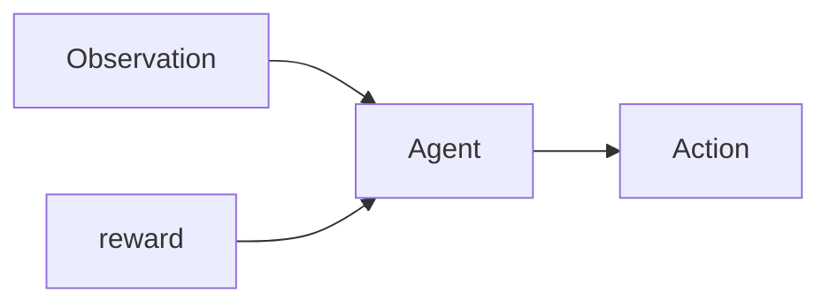
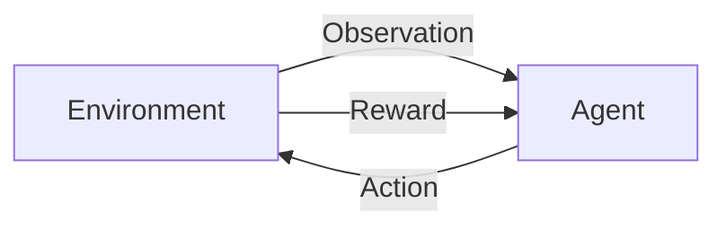
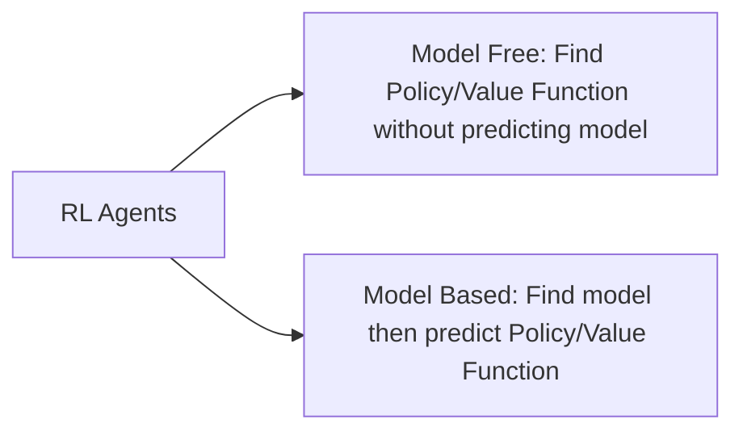
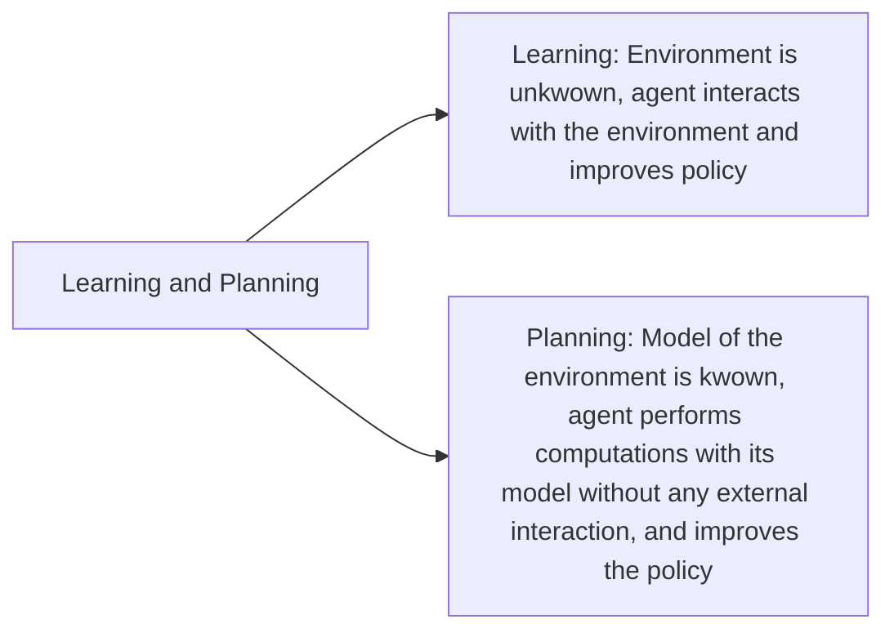

# **Reinforcement Learning**

## Contents
1. [Introduction to Reinforcement Learning](#introduction-to-reinforcement-learning)
2. [The Reinforcement Learning Problem](#the-reinforcement-learning-problem)
2. [The RL Agent](#the-rl-agent)
2. [Problems within Reinforcement Learning](#problems-within-reinforcement-learning)
2. [Markov Process ](#markov-process)


---
## Introduction to Reinforcement Learning
### Machine Learning consists of:
1. Supervised Learning 
2. Unsupervised Learning 
3. Reinforcement Learning

### Difference from other machine learning algorithms:  
1. There is no 'supervisor', only a reward signal
2. The feedback is delayed, not instantaneous
3. Time matters (sequential, non iid (independent and identically distributed) data)
4.  Actions affect subsequent data


### Misc
1. Takes 2-3 days to train a policy

---
## The Reinforcement Learning Problem:
### **Reward R<sub>t</sub>**
1.  scalar feedback signal inducating how well the agent is doing
> **Def<sup>n</sup>** Reward Hypothesis: All goals can be described by the maximisation of expected cumulative reward

### **Goal** 
1. Select actions to maximise total future reward
2. It may be better to sacrifice immediate reward to gain more long term reward.

### **Agent and Environment**

Our job is to figure out what algorithm sits inside *Agent*



At each time step *t*
- The Agent: Executes action A<sub>t</sub>, Receives observation O<sub>t</sub> , Receives scalar reward R<sub>t</sub>
- The Environment: Receives action A<sub>t</sub>, emits observation O<sub>t</sub> , emits scalar reward R<sub>t</sub>

### **History**
Sequence od observations, actions, rewards

$H_{t}=A_{1},O_{1},R_{1}\ldots A_{t}, O_{t},R_{t}$

Based on the history:
1. Agent selects actions
2. Environment selects observation

### **State**
1. information used to determine what happens next
2. $S_{t} = f(H_{t})$

### **Environment state** $S_{t}^{e}$
1. Environments private representation 
2. What state is the environment in?
3. this data is used by the environment to pick the next observation/state
4. Not always visible to the agent, agent only gets state and reward

### **Agent State** $S_{t}^{a}$
1. Numbers that represent the agents state
2. This data is used to pick the next action by the reinforcement learning algorithm
3. Can be a function of history: $S_{t}^{a} = f(H_{t})$

### **Information/Markov State**
1. Contains all important information from the history

> **Def<sup>n</sup>** A state is *Markov* iff 
> $$P\left[ S_{t+1}| S_{t}\right] =P\left[ S_{t+1}| S_{1},\ldots S_{t}\right]$$

2. The future is independent of the past given the present: 
$H_{1:t}\rightarrow S_{t}\rightarrow H_{t+1:\infty}$

 3. The environment state $S_{t}^{e}$ is Markov as it takes decision based on current state 

 4. The history $H_{t}$ is also a Markov state, although a bad/useless one

 ### **Fully Observable Environment** 
 1. 
 >**Def<sup>n</sup>** Full ovbservability: agent ditectly observes environment state:
> $$O_{t} = S_{t}^{a} = S_{t}^{e}$$

2. Agent state = environment state = information state
3. This is kwown as **Markov Decision Process**
  


### **Partial Observability**
1. Agent *indirectly* observes environment 
2. Agent state $\neq$ environment
3. **Partially observable Markov decision process(MDP)**
4. Agent must construct its own state representation $S_{t}^{a}$
5. Naive approach: $S_{t}^{a}= H_{t}$
6. **Beliefs** of environment state:  $S_{t}^{a}= (P[S_{t}^{e} = s^{1}], \ldots, P[S_{t}^{e} = s^{n}])$
7. Recurrent nueral network: $S_{t}^{a} = \sigma(S_{t}^{a} W_{s} + O_{t}W_{0})$
---
## The RL Agent

#### **Policy**: agents behaviour function
#### **Value Function:** how good each state and/or action
#### **Model:** agents representation of the environment

### **Policy**
1. map from state to action
2. Deterministic Policy: $a = \pi(s)$
2. Stochastic Policy: $\pi(a|s) = P[A = a| S = s]$

### **Value Function:**
1. Prediction of future reward
2. Used to evaluate *goodness* of states
3. $V_{\pi }\left( s\right) =E_{\pi }[ R_{t}+\gamma R_{t+1}+\gamma ^{2}R_{t+2}+\ldots | S_{t}= s]$

### **Model:**
1. Predicts what the environment will do next
2. **Transition**: $\mathcal{P}$ predicts the next state 
3. **Rewards:** $\mathcal{R}$ predicts the next (immediate) reward
 $$\mathcal{P} = \mathbb{P}[S' = s' | S=s, A=a]$$
 $$\mathcal{R} = \mathbb{E}[R| S=s, A=a]$$

 ### Categorizing RL agents
 ```mermaid
graph LR
A[RL Agents] -->B[Value Based: No Policy/Implicit Policy, Value Function]
A --> C[Policy Based: Policy, has no Value Function]
A --> D[Actor Critic: has Policy as well as Value Function]

```

---
## Problems within Reinforcement Learning
1. 


2. Exploration and exploitation: Finding balance between exploration and exploitation.

---
## Markov Decision Process

1. MDPs formally describe an environment
3. Environment is *fully observable*
3. Current state completely characterises the process
4. Almost all RL problems can be formalised with MDPs, e.g. optimal control, partially observable problems can be converted to into MDPs, Bandits are MDPs with one state

### Markov Property
*"The future is independent of the past given the present"*
> **Def<sup>n</sup>** A state is *Markov* iff 
> $$P\left[ S_{t+1}| S_{t}\right] =P\left[ S_{t+1}| S_{1},\ldots S_{t}\right]$$

### State Transition Matrix

State Transition Probability:
$$\mathcal{P}_{ss'} = \mathbb{P}[S' = s' | S=s, A=a]$$

State Transition Matrix $\mathcal
{P}$ defines transition probabilities from all states s to all successor states s', 
$$ \mathcal{P}=from(columns), to (rows) \begin{bmatrix}
\mathcal{P}_{11} & \ldots  & \mathcal{P}_{1n} \\\vdots && \vdots\\
\mathcal{P}_{n1}, & \ldots  & \mathcal{P}_{nn}
\end{bmatrix}$$

Each row sums to 1

### Markov Process

A Markov process os a memoryless random process, i.e. a sequence of random states $S_{1}, S_{2}, S_{3}..$ with the Markov Property.
> **Def<sup>n</sup>** *Markov Process* (or *Markov Chain*) is a tuple $\langle \mathcal{S}, \mathcal{P}\rangle$
> - $\mathcal{S}$ is a finite set of states
> - $\mathcal{P}$ is a state transition probability matrix, 
> $$\mathcal{P}_{ss'} = \mathbb{P}[S' = s' | S=s, A=a]$$

### Markov Reward Proccess

> **Def<sup>n</sup>** *Markov Reward Process* is a tuple $\langle \mathcal{S}, \mathcal{P}, \mathcal{R}, \gamma \rangle$
> - $\mathcal{S}$ is a finite set of states
> - $\mathcal{P}$ is a state transition probability matrix, 
> $$\mathcal{P}_{ss'} = \mathbb{P}[S' = s' | S=s, A=a]$$
> - $\mathcal{R}$ i s a reward function, 
> $$ \mathcal{R}_{s} = \mathbb{E}[R_{t+1}|S_{t}= s]$$
> - $\gamma$ is a discount function, $\gamma \in [0, 1]$

### Reward

> **Def<sup>n</sup>** Return $G_{t}$ is the total reward from time-step t 
> $$G_{t}=R_{t+1}+\gamma R_{t+2}\ldots =\sum ^{\infty }_{k=0}\gamma ^{k}R_{t+k+1}$$

- The value of receiving reward R after k+1 time steps is $\gamma^{k}R$


### Why discount?
- Uncertainty: We do not have a perfect model, we dont want to trust the future too much.
- Mathematically convinient 
- Avoids infinite returns
- Uncertainty about the future may not be fully represented 
- If the reward is finantial, immdiate rewards may earn more interest than delayed rewards
- Animal/human behaviour shoes prefernce for immediate reward
- 
### Value Function
- The value function v(s) gives the longn term values of state s
> **Def<sup>n</sup>**  The *value function v(s)* of an MRP is the expected return starting from state s
> $$v(s) = \mathbb{E}[G_{t}|S_{t} = s]$$

 - How to calculate? Takes multiple samples from the Markov process, find discount reward for each sample(episode) anad then take average.

### Bellman Equantion
- The value function can be decomposed into summation of immediate reward($R_{t+1}$) and value of succesor state $\gamma$ $v(S_{t+1})$

$$ \begin{align*} v(s) &= \mathbb{E}[G_{t}| S_{t} = s]\\ &=\mathbb{E}[R_{t+1}+\gamma R_{t+2}\ + \gamma^{2} R_{t+3} + \ldots | S_{t} = s]\\&= \mathbb{E}[R_{t+1}+\gamma R_{t+2}\ + \gamma^{2} R_{t+3} + \ldots | S_{t} = s]\\ & = \mathbb{E}[R_{t+1}+\gamma(R_{t+2}\ + \gamma R_{t+3} + \ldots )| S_{t} = s]\\ &= \mathbb{E}[R_{t+1}+\gamma G_{t+1}| S_{t} = s] \end{align*}$$

### In Matrix Form


$$ \begin{bmatrix}\ v(1)\\\vdots\\v(n)\end{bmatrix} = \begin{bmatrix} \mathcal{R}_{1}\\ \vdots \\ \mathcal{R}_{n} \end{bmatrix}+\gamma\begin{bmatrix}
\mathcal{P}_{11} & \ldots  & \mathcal{P}_{1n} \\\vdots && \vdots\\
\mathcal{P}_{n1}, & \ldots  & \mathcal{P}_{nn}
\end{bmatrix} \begin{bmatrix} v(1) \\ \vdots \\ v(n)\end{bmatrix}$$

which is, 
$$v = \mathcal{R} + \gamma \mathcal{P}v$$


### Solving Bellman equation
$$\begin{align*}v &=  \mathcal{R} + \gamma \mathcal{P}v\\ v(1 - \gamma \mathcal{P}) &=  \mathcal{R} \\ v &=(1 - \gamma \mathcal{P})^{-1}\mathcal{R}  \end{align*} $$

- Direct solutoin only possible for small MRP
- Many iterative methods are available for large MRPs e.g. Dynamic programming, Monte-Carlo evalulation, Temporal Difference learning

### Markov Decison Process

- A Markov Decision process is a Markov reward process with decisions. It is an *environment* in which all states are Markov

> **Def<sup>n</sup>** *Markov Decision Process* is a tuple $\langle \mathcal{S}, \mathcal{A}, \mathcal{P}, \mathcal{R}, \gamma \rangle$
>- $\mathcal{S}$ is a finite set of states
>- $\mathcal{A}$ is a finite set of actions
>- $\mathcal{P}_{ss'}^{a} = \mathbb{P}[S_{t+1} = s' | S_{t}=s, A_{t}=a]$
>- \mathcal{R} is a reward function $ \mathcal{R}_{s}^{a} = \mathbb{E}[R_{t+1}|S_{t}= s, A_{t} = a]$
>- $\gamma$ is a discount factor $\gamma \in [0, 1]$

### Policy 
> **Def<sup>n</sup>** *Policy* $\pi$ is a distribution over all actions given states, 
> 
$\pi(a|s) = \mathbb{P}[A_{t} = a|S_t = s]$

- A policy fully defines the behaviour of an agent